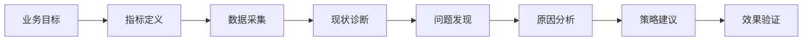

# 产品分析

> 产品分析类 Case 考察候选人对产品功能、用户行为和增长机会的分析能力。常见场景包括功能渗透分析、用户分群和留存优化、产品改版效果等。

## 分析框架

### 通用产品分析流程



### 关键分析角度

| 角度 | 核心问题 | 常用方法 |
|------|----------|----------|
| 功能采用 | 用户是否知道这个功能？是怎么发现的？ | 漏斗分析、路径分析 |
| 功能留存 | 用过的用户是否会持续使用？ | Cohort 分析 |
| 功能频次 | 用户多久用一次？用了多少次？ | 分布分析 |
| 功能深度 | 用户用到什么程度？ | 行为序列分析 |
| 用户分群 | 不同用户使用模式有何差异？ | RFM、聚类 |

---

## 案例 1：新功能"直播带货"采用率分析

**场景**：某电商 App 上线了"直播带货"功能 3 个月。作为数据产品经理，请分析功能采用情况并提出优化建议。

### 分析过程

**Step 1: 定义指标体系**

| 类别 | 指标 | 当前值 |
|------|------|--------|
| 认知层 | 功能曝光率（能看到入口的用户比例） | 60% |
| 尝试层 | 点击率 / 首刷率 | 15% |
| 体验层 | 观看时长 > 30 秒的比例 | 45% |
| 转化层 | 直播加购率 / 下单率 | 8% / 3% |
| 留存层 | 7 日内再次观看直播的比例 | 20% |

**Step 2: 诊断问题**

从漏斗看，最大的流失点在"认知→尝试"（60% × 15% = 只有 9% 的用户尝试过）。

进一步分析不尝试的原因：

```python
# 假设有调研数据
reasons = {
    '不知道有这个功能': 40,   # 入口不够明显
    '不感兴趣/觉得没必要': 30, # 价值认知不足
    '入口太深/找不到': 20,    # 发现成本高
    '打开太慢/卡顿': 10      # 体验问题
}
```

**Step 3: 用户分群**

| 用户群 | 功能尝试率 | 功能留存率 | 特征 |
|--------|-----------|-----------|------|
| 年轻女性 (18-25) | 35% | 40% | 核心用户群 |
| 年轻男性 (18-25) | 20% | 25% | 有潜力 |
| 中年用户 (35+) | 8% | 15% | 需教育 |
| 纯搜索用户 | 3% | 10% | 习惯难改变 |

**Step 4: 深度分析**

核心发现：**年轻女性用户的直播转化率是其他用户的 3 倍**，但她们在 App 中的功能入口曝光率仅为 50%（首页推荐没有个性化）。

**Step 5: 建议**

短期：
1. **个性化入口**：对年轻女性用户在首页增加直播入口权重
2. **新人引导**：首刷用户引导观看热门直播片段
3. **社交裂变**：分享直播间到朋友圈获得优惠券

长期：
1. **内容生态**：扶持优质主播，增加直播场次的多样性
2. **直播+商品**：优化边看边买体验，缩短转化路径
3. **推送策略**：用户关注的主播开播时做精细化推送

**效果预估**：
- 个性化入口预计提升尝试率 10pp（从 15% 到 25%）
- 结合优化，3 个月内直播 GMV 占比预计从 5% 提升到 12%

---

## 案例 2：用户留存下降分析

**场景**：某内容社区 App 的次日留存率从 45% 下降到 40%，请分析原因并提出改进建议。

### 分析过程

**Step 1: 确认问题**

首先区分是新用户留存下降还是老用户活跃度下降：

| 用户群 | 变化前 | 变化后 | 变化 |
|--------|--------|--------|------|
| 新用户次日留存 | 30% | 28% | -2pp |
| 老用户次日留存 | 55% | 50% | -5pp |
| **整体次日留存** | **45%** | **40%** | **-5pp** |

**主要问题是老用户活跃度下降**。

**Step 2: 下钻分析**

按首次访问时间 Cohort：
| Cohort (首次访问周) | Week 1 | Week 2 | Week 3 | Week 4 |
|---------------------|--------|--------|--------|--------|
| 2024-W1 | 45% | 35% | 30% | 28% |
| 2024-W2 | 44% | 34% | 28% | — |
| 2024-W3 | 43% | 32% | — | — |
| 2024-W4 | **38%** | — | — | — |

**W4 周的新用户留存曲线明显劣于前几周**，说明近期用户质量或引导流程出了问题。

**Step 3: 行为分析**

对比留存用户 vs 流失用户的关键行为差异：

| 关键行为 | 留存用户 | 流失用户 | 差异 |
|----------|----------|----------|------|
| 首日关注 >= 3 个创作者 | 60% | 25% | +35pp |
| 首日有互动（点赞/评论） | 75% | 30% | +45pp |
| 首日阅读 >= 5 篇文章 | 80% | 40% | +40pp |

**核心发现**：**首日互动行为是预测留存的最强信号**。

**Step 4: 原因分析**

为什么近期新用户的互动率下降？
- **新引导流程改版**：2 周前上线了新用户引导流程，互动引导步骤被后置
- **渠道结构变化**：新增了一个低质渠道（信息流投放），带来的用户互动率低

**Step 5: 改进建议**

1. **恢复/优化新用户引导**：将 "关注 3 个创作者" 和 "首次互动" 提到引导流程最前面
2. **优化渠道策略**：暂停低质渠道投放，或调整定向策略
3. **冷启动推荐优化**：新用户首次 feed 中增加高互动内容的权重

---

## 常用分析方法

### RFM 用户分群

```python
def rfm_segmentation(df):
    # R: 最近一次消费时间
    # F: 消费频率
    # M: 消费金额
    rfm = df.groupby('user_id').agg({
        'last_order_date': lambda x: (pd.Timestamp.now() - x.max()).days,  # R
        'order_id': 'count',  # F
        'amount': 'sum'  # M
    })
    
    # 分箱评分
    rfm['R_score'] = pd.qcut(rfm['last_order_date'], 4, labels=[4, 3, 2, 1])
    rfm['F_score'] = pd.qcut(rfm['order_id'], 4, labels=[1, 2, 3, 4])
    rfm['M_score'] = pd.qcut(rfm['amount'], 4, labels=[1, 2, 3, 4])
    
    # 用户分层
    rfm['segment'] = rfm.apply(
        lambda x: '重要价值' if x.R_score >= 3 and x.F_score >= 3 and x.M_score >= 3
        else '重要发展' if x.R_score >= 3 and x.F_score >= 3
        else '重要保持' if x.R_score < 3 and x.F_score >= 3
        else '一般用户', axis=1
    )
    return rfm
```

### 漏斗分析

使用留存曲线的幂律拟合来预测长期留存：

```python
import numpy as np
from scipy.optimize import curve_fit

def retention_curve(days, a, b):
    """幂律函数拟合留存曲线: y = a * x^(-b)"""
    return a * np.power(days, -b)

# 拟合历史留存数据预测未来
x_data = np.array([1, 3, 7, 14, 30])
y_data = np.array([0.40, 0.25, 0.18, 0.12, 0.08])

params, _ = curve_fit(retention_curve, x_data, y_data)
predicted_day90 = retention_curve(90, *params)
```

---

## 自测题

1. 某音乐 App 的付费转化率连续 3 个月下降，如何分析？
2. 社交 App 的"朋友圈"功能使用率远低于竞品，请诊断原因
3. 教育 App 的课程完成率只有 15%，如何找出关键瓶颈并优化？
