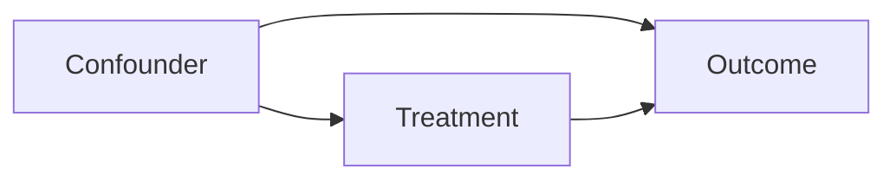

# 实验与因果推断

> 从 A/B 测试到准实验方法，再到因果推断框架。帮助分析师在观测数据和实验数据中做出可靠的因果归因。

## A/B 测试基础

### 实验设计要点

| 要素 | 要求 | 常见错误 |
|------|------|---------|
| 随机化 | 用户在实验组/对照组随机分配 | 未考虑网络效应 |
| 样本量 | 基于 MDE 预计算 | 样本不足导致检验效力低 |
| 时长 | 覆盖完整业务周期（含周末） | 时长过短产生新奇效应 |
| 指标 | 核心指标 + 护栏指标 | 只看提升不看负向影响 |

### 样本量估算

```python
import scipy.stats as st

def min_sample_size(baseline, mde, alpha=0.05, power=0.8):
    z_alpha = st.norm.ppf(1 - alpha / 2)
    z_beta = st.norm.ppf(power)
    p_pooled = baseline + baseline * mde / 2
    se = 2 * p_pooled * (1 - p_pooled)
    n = ((z_alpha + z_beta) ** 2 * se) / (baseline * mde) ** 2
    return int(np.ceil(n))

# 例：基线转化率 10%，MDE=1%，每组需要约 14,000 用户
n = min_sample_size(0.10, 0.01)
```

## A/B 测试进阶

### 分层实验（Overlapping Experiments）

大型平台同时运行多个实验，采用互斥分层或正交分层：

- **互斥层**：用户被划分到某一实验，简单但浪费流量
- **正交层**：通过 hash user_id 到不同参数空间实现多实验并行

### 网络效应（Network Effects）

当用户之间存在交互（社交产品、市场平台）时，实验组和对照组的用户会相互影响。缓解策略包括：

- **集群随机化**：按群组/地域而非用户分配
- **成对设计**：匹配相似集群后随机分配

### SRM（Sample Ratio Mismatch）

实验组和对照组的用户数比例偏离预期分配比。常见原因：

- 客户端 SDK 缓存或跳跃问题
- 用户 ID 不可靠（重复或空值）
- 日志丢失或处理错误

```python
# SRM 检测卡方检验
from scipy.stats import chisquare
# expected: 50/50 split
chisquare([obs_control, obs_treatment], f_exp=[total * 0.5, total * 0.5])
# p < 0.05 则怀疑存在 SRM
```

### 多重比较校正

| 方法 | 描述 | 适用场景 |
|------|------|---------|
| Bonferroni | p = α / m（m 为比较次数） | 保守，m 较小时 |
| FDR (BH) | 控制错误发现率 | 大量指标，更宽松 |

```python
# FDR（Benjamini-Hochberg）校正
from scipy.stats import false_discovery_control
p_adjusted = false_discovery_control(p_values)
```

## AA 测试与实验验证

在正式实验前，通过 AA 测试验证实验基础设施的可靠性：
- 将同一批用户随机分两组，不施加任何干预
- 检验两组指标的差异是否在预期波动范围内
- 重复运行 20+ 次，检查 Type I Error 率是否接近 α

## 准实验方法（Quasi-Experimental Methods）

当随机化不可行时，使用准实验方法近似因果效应。

### DID（Difference-in-Differences）

```python
# DID = (Treatment_after - Treatment_before) - (Control_after - Control_before)
did = (t_after - t_before) - (c_after - c_before)
```

前提假设：**平行趋势假设（Parallel Trend Assumption）**——对照组的变化趋势代表了处理组在无干预情况下的反事实。

### RDD（Regression Discontinuity Design）

当干预由连续变量的门槛值决定时适用。

```python
# 门槛示例：分数 >= 60 分进入实验组
# 在门槛附近（如 55-65 分）比较两组的结局差异
# 核心是局部线性回归 + 最优带宽选择
```

### Synthetic Control（合成控制法）

通过加权组合多个对照组单元构造一个"合成"对照组，更灵活地满足平行趋势假设。适用于单一处理单元的 DID 改良。

## IV 与 PSM

### Instrumental Variables（工具变量）

解决存在未观测混杂时的因果识别。核心要求：

1. **相关性**：IV 与处理变量 T 相关
2. **外生性**：IV 仅通过 T 影响结局 Y（排除限制条件）

### Propensity Score Matching（倾向得分匹配）

```python
from sklearn.linear_model import LogisticRegression

# 估计倾向得分
model = LogisticRegression()
model.fit(X, treatment)
propensity = model.predict_proba(X)[:, 1]

# 基于倾向得分匹配处理组与对照组
# 常用方法：最近邻匹配、卡钳匹配、核匹配
```

## 因果推断框架

### DAG（Directed Acyclic Graph）

有向无环图，用图形表达变量间的因果假设。



| 节点角色 | 含义 | 处理方式 |
|---------|------|---------|
| Confounder（混杂因子） | 同时影响 T 和 Y | 控制（分层/回归/Matching） |
| Collider（碰撞因子） | T 和 Y 共同影响 | 不应控制 |
| Mediator（中介变量） | T → M → Y | 控制会遮蔽直接效应 |

### Confounder vs Collider

- **Confounder**：`T ← C → Y`，不控制则产生虚假关联，控制后得到因果效应
- **Collider**：`T → C ← Y`，控制后反而引入虚假关联（Berkson's Paradox）

### Mediation Analysis（中介分析）

当想了解 T 通过什么路径影响 Y 时：

```
T → M → Y
  ↙      ↗
直接效应  间接效应（经 M）
```

## 相关文章

- [统计学与概率论](/knowledge-map/km-3-statistics) — 假设检验的理论基础
- [机器学习基础](/knowledge-map/km-11-ml) — 模型因果推断方法
- [分析方法论](/knowledge-map/km-5-analysis-methods/) — 业务分析中的因果思维
